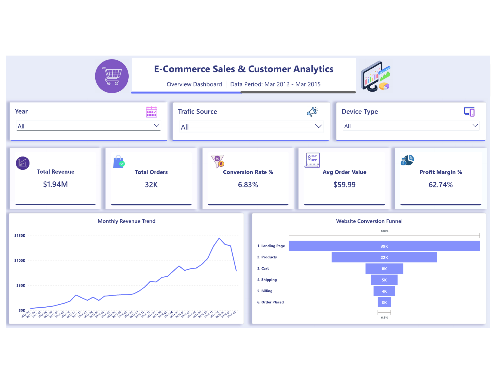
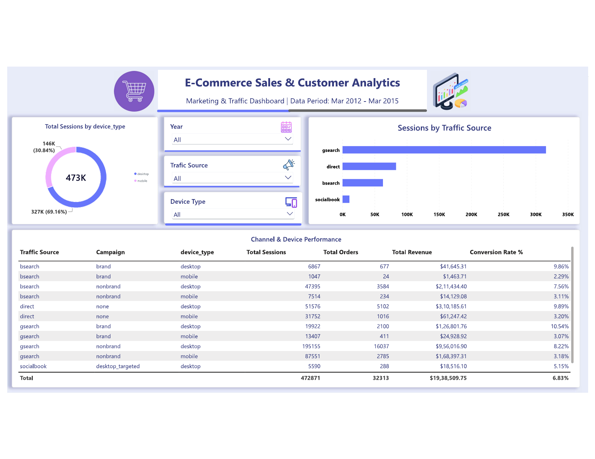
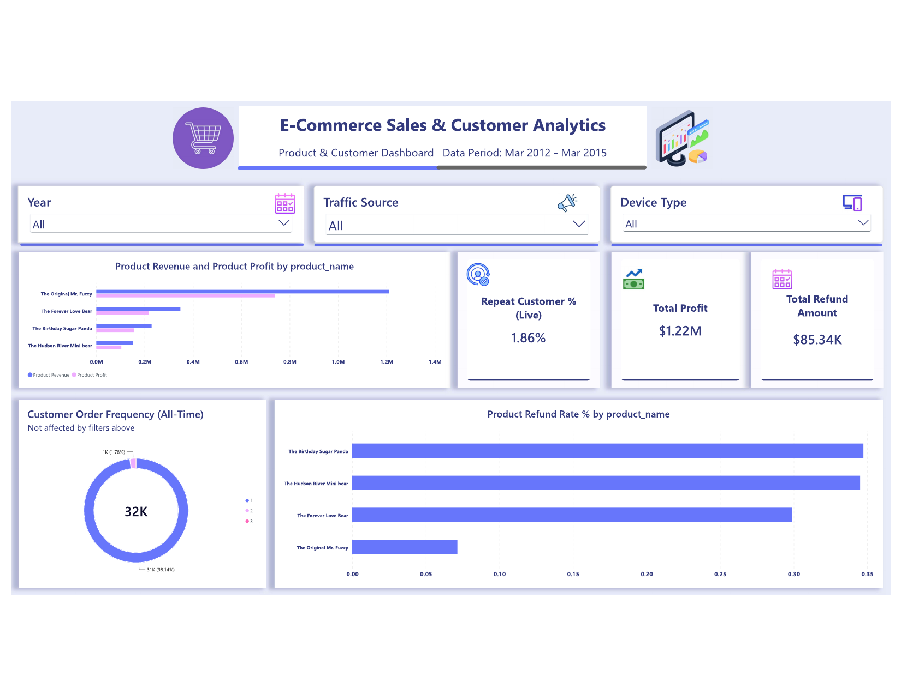

# E-Commerce Sales & Customer Analytics

End-to-end data analytics project analyzing 3+ years of e-commerce data (2012–2015) using **MySQL** for data modeling and analysis, and **Power BI** for building an interactive dashboard.

---

## 📌 Project Overview

This project analyzes website traffic, sales performance, and customer behavior for an e-commerce business selling soft toys. The goal was to answer real business questions — which marketing channels perform best, where customers drop off in the funnel, which products drive revenue, and how loyal the customer base is — and present the findings through a fully interactive Power BI dashboard.

**Dataset size:** ~470K website sessions, ~32K orders, ~40K order items, spanning March 2012 to March 2015.

---

## 🛠️ Tools Used

- **MySQL** — database design, data cleaning, SQL analysis (joins, subqueries, window-style aggregations, views)
- **Power BI** — data modeling, DAX measures, interactive dashboard design
- **GitHub** — version control and portfolio documentation

---

## 🗂️ Repository Structure

```
├── sql/
│   └── ecommerce_analysis.sql       # Full SQL script: table creation, analysis queries, views
├── screenshots/
│   ├── 01_overview.png              # Dashboard Page 1
│   ├── 02_marketing_traffic.png     # Dashboard Page 2
│   └── 03_product_customer.png      # Dashboard Page 3
└── README.md
```

---

## 🧱 Data Model

Six raw tables were loaded into MySQL: `website_sessions`, `website_pageviews`, `products`, `orders`, `order_items`, and `order_item_refunds`. Six SQL views were then built on top to pre-aggregate data for reporting, and a relational data model was created in Power BI with proper one-to-many relationships between sessions, orders, order items, and products.

> **Note:** Due to file size constraints, `website_pageviews` was sampled (every 12th row) for the funnel analysis — this preserves the full date range and drop-off *pattern*, though absolute pageview counts are proportionally smaller than the full dataset.

---

## 📊 Dashboard

### Page 1 — Overview
KPI summary (Revenue, Orders, Conversion Rate, AOV, Profit Margin), a monthly revenue trend, and a website conversion funnel.



### Page 2 — Marketing & Traffic
Traffic source performance, device-type split, and a detailed channel/device breakdown table.



### Page 3 — Product & Customer
Product-level revenue, profit, and refund rates, alongside customer order frequency analysis.



All three pages are fully interactive — Year, Device Type, and Traffic Source slicers are synced across pages and filter every visual (KPIs, trend chart, and funnel) simultaneously.

---

## 🔍 Key Insights

**Traffic & Marketing**
- Google Search (nonbrand) alone drives **~60% of total traffic** — a strong channel, but also a concentration risk.
- Desktop converts at **8.50%** vs. mobile's **3.09%** — more than double, despite mobile share growing.

**Funnel Performance**
- Overall session-to-order conversion rate is **6.83%**, above the typical e-commerce benchmark of 2–3%.
- The biggest drop-off happens between **Products → Cart (64% of visitors leave)** — the single largest funnel leak.

**Sales & Revenue**
- Total revenue across the period: **$1.94M**, with a healthy **62.74% profit margin**.
- **"The Original Mr. Fuzzy"** (the flagship product) drives **62.5% of total revenue** — a single-product dependency risk.
- **"The Birthday Sugar Panda"** has the highest refund rate (**6.04%**), suggesting a potential quality or expectation-mismatch issue.

**Customer Behavior**
- **98.14% of customers purchase only once** — repeat purchase rate is just **1.86%**, highlighting a major retention gap.
- Customers who do return make their second purchase **~35 days** after their first, on average — useful timing for retention/email campaigns.

---

## 💡 Business Recommendations

1. Diversify marketing spend beyond Google Search nonbrand to reduce channel concentration risk.
2. Investigate and redesign the Product page — it's the biggest point of funnel leakage.
3. Audit "The Birthday Sugar Panda" for quality or description issues given its high refund rate.
4. Launch a retention campaign (e.g., email/discount) targeted around the 30–35 day mark post-purchase to convert more one-time buyers into repeat customers.
5. Improve the mobile checkout experience to close the conversion gap with desktop.

---

## 📈 SQL Highlights

The [SQL script](sql/ecommerce_analysis.sql) includes:
- Table creation and data quality checks (NULL checks, duplicate checks, range validation)
- 15+ analysis queries across traffic, funnel, sales, and customer behavior
- Use of `JOIN`, `LEFT JOIN`, subqueries, derived tables, `CASE WHEN` conditional aggregation, and `COALESCE`
- 6 reusable SQL views built specifically to feed the Power BI data model

---

## 📬 Contact

Feel free to reach out if you have questions about this project or want to connect!

**[Julfikar Ali]**
[www.linkedin.com/in/julfikar1995] | [zulfikar1944@gmail.com]
